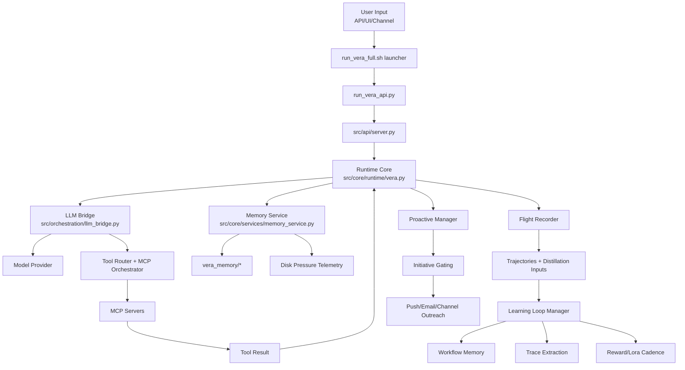

# VERA Wiring Flow (Microscope Pass)

Last updated: 2026-02-24 UTC

## End-to-End Runtime Flow

## Lifecycle and Guard Rails

1. Boot
- `scripts/run_vera_full.sh` clears stale `tmp/shutdown_requested`, enforces `vera_memory/manual_halt`, forwards runtime flags to API.

2. Request handling
- `/v1/chat/completions` and related API routes flow through `src/api/server.py` into runtime orchestrators.
- Tool calls route through the MCP orchestrator and native tool handlers.

3. Memory and continuity
- `src/core/services/memory_service.py` reports memory telemetry including `disk_usage`.
- Default budget is 1024 MB unless overridden by `VERA_MEMORY_MAX_FOOTPRINT_MB` or launcher flags.

4. Learning loops
- Flight recorder captures transitions.
- Learning loop manager extracts successes, records workflows, and maintains LoRA/reward cadence state.

5. Recovery posture
- Failed tool chains are guarded by workflow protections and fallback logic in LLM bridge/runtime.
- Manual halt sentinel intentionally blocks launcher starts for operator safety.

## Validation Signals (What We Treat as Healthy)

1. API readiness
- `/api/health` and `/api/readiness` must report `ready=true`, no critical server blockers.

2. Memory pressure
- `/api/memory/stats` must include `disk_usage` with `budget_mb`, `total_mb`, `pressure`, `over_budget`.

3. Learning loop alive
- `/api/learning/status` reports `stats.running=true`.
- `/api/learning/lora-readiness` reports backend selection and blockers explicitly.

4. Tooling control plane
- `/api/tools/list` and `/api/tools/defs` return non-empty tool catalogs.
- Targeted tool verification script returns 0 hard failures.

5. Runtime guard tests
- `scripts/vera_system_audit.py --with-tests` returns 0 critical failures.
- `scripts/vera_controlled_checks.py` returns `overall_ok=true`.
- `scripts/vera_release_gate_local.py --run-regression` returns overall PASS.

## Known Micro-Gap from This Pass

1. Stale shutdown flag side effect
- `tmp/shutdown_requested` can remain after temp API shutdown checks.
- Mitigation implemented: `scripts/vera_tool_verification.py` now ignores this file by default and only honors it when `--respect-shutdown-flag` is provided.
